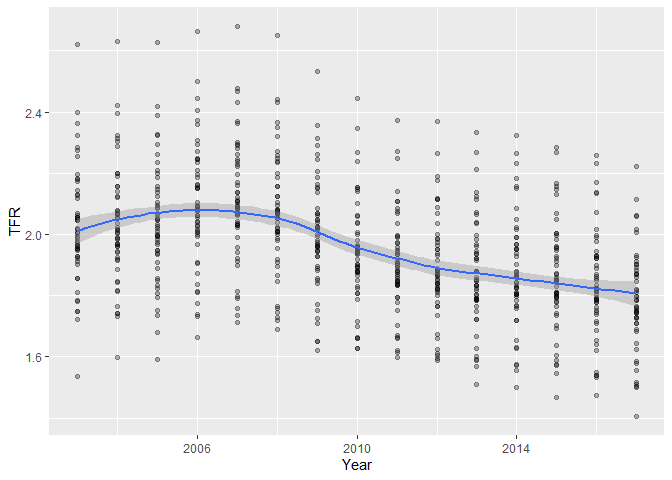

A1
================
Braden Baker
3/6/2019

## The Question:

What are the basic facts concerning birth rates in the US? Is the US in
danger of shrinking?

## The Data

This assignment uses natality data from
<https://wonder.cdc.gov/natality.html>.

## Problem 1:

Obtain a file of data from the site for births between 2007 and 2017.
Specify groupings by maternal age (9), State and year. Use your text
editor to remove all of the blank spaces in the column header. Import
this data into your R session using the readr package. Note the warning
messages.

What issues do you need to deal with before analyzing this data?

## Problem 2:

Use dplyr to clean up the data (remove any NA values). Remove most of
the variables. You should leave only State, Year, Age, Fpop, Births, and
Rate. Make sure that all of your numerical data is recognized as such by
R. Run a summary on your dataframe to verify your work.

``` r
# Insert your R code here.
library(dplyr)
```

    ## 
    ## Attaching package: 'dplyr'

    ## The following objects are masked from 'package:stats':
    ## 
    ##     filter, lag

    ## The following objects are masked from 'package:base':
    ## 
    ##     intersect, setdiff, setequal, union

``` r
library(ggplot2)
library(tidyverse)
```

    ## -- Attaching packages ------------------------------------------------------------------------------------------------------------------------ tidyverse 1.3.0 --

    ## <U+2713> tibble  2.1.3     <U+2713> purrr   0.3.3
    ## <U+2713> tidyr   1.0.0     <U+2713> stringr 1.4.0
    ## <U+2713> readr   1.3.1     <U+2713> forcats 0.4.0

    ## -- Conflicts --------------------------------------------------------------------------------------------------------------------------- tidyverse_conflicts() --
    ## x dplyr::filter() masks stats::filter()
    ## x dplyr::lag()    masks stats::lag()

``` r
library(plotly)
```

    ## 
    ## Attaching package: 'plotly'

    ## The following object is masked from 'package:ggplot2':
    ## 
    ##     last_plot

    ## The following object is masked from 'package:stats':
    ## 
    ##     filter

    ## The following object is masked from 'package:graphics':
    ## 
    ##     layout

``` r
load("A1.RData")

NatalityA12007_2017 <- Natality_2007_2017 %>%
  filter(Rate != "Not Available" & Fpop != "Not Available") %>%
  mutate(Fpop = as.numeric(Fpop), Rate = as.numeric(Rate)) %>%
  select(State, Year, Age, Fpop, Births, Rate)

summary(NatalityA12007_2017)
```

    ##     State                Year          Age                 Fpop        
    ##  Length:3366        Min.   :2007   Length:3366        Min.   :  15120  
    ##  Class :character   1st Qu.:2009   Class :character   1st Qu.:  53379  
    ##  Mode  :character   Median :2012   Mode  :character   Median : 140936  
    ##                     Mean   :2012                      Mean   : 205626  
    ##                     3rd Qu.:2015                      3rd Qu.: 234273  
    ##                     Max.   :2017                      Max.   :1513117  
    ##      Births            Rate       
    ##  Min.   :   105   Min.   :  4.33  
    ##  1st Qu.:  2332   1st Qu.: 27.88  
    ##  Median :  6336   Median : 59.78  
    ##  Mean   : 13122   Mean   : 64.08  
    ##  3rd Qu.: 16888   3rd Qu.:101.16  
    ##  Max.   :150629   Max.   :178.46

## Problem 3:

Repeat the steps above for the other two periods of data available. Make
sure that all three of your dataframes have the same variable names and
that the variables are consistent in type. Use rbind to combine all of
the data into a single dataframe named allBirths. Run a summary to
verify your results.

``` r
# Insert your code here.

NatalityA12003_2006 <- Natality_2003_2006 %>%
  filter(Rate != "Not Available" & Fpop != "Not Available") %>%
  mutate(Fpop = as.numeric(Fpop), Rate = as.numeric(Rate)) %>%
  select(State, Year, Age, Fpop, Births, Rate)

allBirths <- bind_rows(NatalityA12007_2017, NatalityA12003_2006)
summary(allBirths)
```

    ##     State                Year          Age                 Fpop        
    ##  Length:4590        Min.   :2003   Length:4590        Min.   :  13982  
    ##  Class :character   1st Qu.:2006   Class :character   1st Qu.:  53379  
    ##  Mode  :character   Median :2010   Mode  :character   Median : 141235  
    ##                     Mean   :2010                      Mean   : 204848  
    ##                     3rd Qu.:2014                      3rd Qu.: 234517  
    ##                     Max.   :2017                      Max.   :1513117  
    ##      Births            Rate       
    ##  Min.   :    91   Min.   :  3.93  
    ##  1st Qu.:  2330   1st Qu.: 29.38  
    ##  Median :  6592   Median : 60.67  
    ##  Mean   : 13229   Mean   : 65.21  
    ##  3rd Qu.: 16972   3rd Qu.:102.11  
    ##  Max.   :150629   Max.   :184.05

## Problem 4:

Use dplyr to produce a dataframe, fertHistory, with one row for every
combination of State and Year. The variables in the dataframe are:
State, Year, and TFR.

``` r
fertHistory <- allBirths %>%
  group_by(State, Year) %>%
  summarize(TFR=sum(Rate)) %>%
  mutate(TFR=(TFR/1000)*5) %>%           
  select(State, Year, TFR)

head(fertHistory)
```

    ## # A tibble: 6 x 3
    ## # Groups:   State [1]
    ##   State    Year   TFR
    ##   <chr>   <dbl> <dbl>
    ## 1 Alabama  2003  1.92
    ## 2 Alabama  2004  1.92
    ## 3 Alabama  2005  1.94
    ## 4 Alabama  2006  2.01
    ## 5 Alabama  2007  2.04
    ## 6 Alabama  2008  2.02

## Problem 5:

Use ggplot2 to produce a scatterplot with Year in the explanatory role
and TFR in the response role. Add a loess curve to the plot.

``` r
ggplot(fertHistory, aes(x=Year, y=TFR))+geom_point(alpha=0.3)+geom_smooth(method="loess")
```

<!-- --> \#\# Problem 6:
Write a paragraph describing the facts revealed by the graphic.

This graphic reaveals that from 2003 to 2006 the total fertility rate
was rising, which peaked in 2006. Since then, it has been steadily
falling. The biggest fall in total fertility appears to occur from 2008
to 2010. It is also intereasting to note that it appears that around
2008, both the high and low outliers started to get closer to the bulk
of the data.
